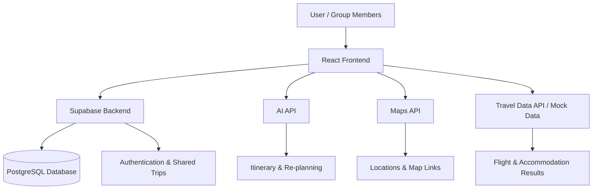

# JomTravel-by-ZooNegara-MMUCodeNection-2026
Lifestyle Track: Planning an Escape

# JomTravel by ZooNegara

> Plan smarter. Travel together. Make every journey an adventure.

**Team:** ZooNegara  
**Members:** Jackson Yeoh, Tan Wei Ni  
**Problem Statement:** Travel Planner

**Video Presentation:** [Watch our presentation](https://youtu.be/LBJMipqd9Jc)

**Presentation Slides:** [View our presentation slides](https://canva.link/0n2v3z0hi5cc2s2)

---

## 1. Project Overview

### The Problem

Planning a trip involves coordinating flights, accommodation, transportation, activities, budgets, and personal preferences. Travellers often have to switch between multiple platforms to compare prices, make bookings, organise itineraries, and communicate with their travel companions.

This becomes even more challenging for group trips, where different people have different budgets, interests, schedules, and expectations.

The main causes of this problem include:

- Fragmented travel planning tools that handle only one part of the travel experience.
- Difficulty comparing affordable flights and accommodation while keeping track of total spending.
- Time-consuming itinerary planning that may not account for travel distance, opening hours, or personal interests.
- Poor coordination between group members when deciding activities and sharing expenses.
- Limited support when unexpected events, such as flight delays, bad weather, or cancelled activities, disrupt the original itinerary.
- Lack of engagement and motivation in the planning process, which can make organising a trip feel like a chore.

### Stakeholders

| Stakeholder | Needs |
|---|---|
| Solo travellers | Affordable travel options, personalised itineraries, and convenient trip management. |
| Group travellers | Shared planning, preference matching, communication, and expense splitting. |
| Budget-conscious travellers | Flight and accommodation comparisons with clear cost estimates. |
| Travel service providers | Opportunities to direct users to booking platforms. |
| Friends and travel companions | An easy way to coordinate activities and share experiences. |

### Existing Market Solutions and Their Limitations

| Existing App | What It Offers | Why It Falls Short |
|---|---|---|
| [Skyscanner](https://www.skyscanner.com/) | Flight and travel price comparison. | Primarily focuses on searching travel deals rather than providing a complete shared travel experience. |
| [Booking.com](https://www.booking.com/) | Accommodation and travel bookings. | Strong booking functionality, but users may still need separate tools for group coordination, quests, and a unified trip workspace. |
| [Google Maps](https://maps.google.com/) | Maps, places, navigation, and saved locations. | Useful for discovering places and navigation, but not designed as a complete budget-first group travel planner with game mechanics. |
| [Wanderlog](https://wanderlog.com/) | Trip itineraries, maps, and collaborative travel planning. | Provides many planning features, but our concept focuses on combining deal comparison, group preference matching, and a gamified travel experience. |

### The Gap

Travellers need to manually combine information from different platforms.

JomTravel aims to connect the planning, booking references, budgeting, group coordination, and actual travel experience into one platform.

### Our Solution

JomTravel is an integrated travel planning platform designed to make organising a trip faster, more affordable, and more enjoyable.

Users can compare flight and accommodation options, set a travel budget, and generate personalised itineraries based on their interests, schedules, and destinations.

For group trips, users can invite friends to collaborate, vote on activities, share expenses, and communicate within a shared trip room.

During the journey, JomTravel provides a central dashboard for bookings, maps, checklists, and travel quests, while AI-assisted re-planning helps users adapt when unexpected changes occur.

### Feature Set

#### 1. Flight & Accommodation Comparison

- Compare travel options based on price, dates, and preferences.
- Save selected bookings and direct users to booking providers.
- Automatically include selected costs in the trip budget.

#### 2. AI-Powered Itinerary Builder

- Generate day-by-day itineraries based on budget, hobbies, dates, and location.
- Include activity locations, estimated costs, and map links.
- Organise activities into a practical daily schedule.

#### 3. Group Trip Room

- Invite friends through a shared trip link.
- Combine personal interests and budgets.
- Vote on activities and collaborate on itineraries.
- Chat with travel companions within the platform.

#### 4. Travel Quest & Check-in System

- Complete travel challenges and collect points or badges.
- Check in at selected attractions and activities.
- Encourage friends to explore and create shared memories.

#### 5. Pre-Trip Checklist & Reminders

- Remind users to book flights, prepare documents, and pack.
- Track tasks before departure.
- Provide reminders for upcoming bookings and activities.

#### 6. AI-Assisted Re-planning

- Suggest alternative activities when plans change.
- Adjust itineraries after flight delays or cancellations.
- Recommend indoor activities during bad weather.

---

## 2. Ideation & Process

### 2.1 Ideas We Considered

The following table organises our brainstorming ideas. Selected features are listed first, followed by ideas that were considered but narrowed or dropped for the prototype.

| Idea | Why It Was Dropped / Kept |
|---|---|
| **Flight & accommodation comparison (Chosen)** | Kept because affordable travel options directly support the budgeting problem and provide a strong starting point for the platform. |
| **AI itinerary generator (Chosen)** | Kept because it helps users plan activities based on interests, budget, dates, and location, reducing planning time. |
| **Shared trip dashboard (Chosen)** | Kept because it connects bookings, maps, budgets, and itineraries into one accessible workspace. |
| **Group collaboration & preference matching (Chosen)** | Kept because coordinating different preferences and budgets is a major challenge in group travel. |
| **Travel quests / gamification (Chosen)** | Kept because it differentiates our product from conventional travel planners and encourages engagement during the trip. |
| **Pre-trip checklist & reminders (Chosen)** | Kept because preparation is an important part of travelling and helps users avoid forgetting essential tasks. |
| **AI re-planning for unexpected changes (Chosen)** | Kept as a key differentiator, with a focused prototype scenario such as a delayed flight or rainy day. |
| **Built-in group chat (Chosen — scoped)** | Kept as a lightweight collaboration feature. A full-featured messaging system is outside the initial build scope. |
| Real-time flight and hotel booking APIs | Narrowed for the prototype. Live pricing and availability are useful, but API access, rate limits, and booking integration can increase complexity. |
| Full direct booking system | Dropped from the initial build. The prototype will use comparison results and booking links instead of handling payments and reservations directly. |
| Full social media travel platform | Dropped because it expands the product beyond the core travel planning problem. |
| Advanced AR navigation | Dropped because it requires additional development and is not essential to demonstrate the solution. |
| AI-generated travel videos | Dropped because it does not directly solve the main planning and coordination problems. |
| Complex location-verified quest system | Narrowed to simple check-ins or photo submissions for the prototype. |

### 2.2 Ideation Boards

Our ideation process explored the causes of travel planning stress, possible features, and the overall user journey.

#### Ideation Board 1 — Problem Tree / Affinity Diagram

This board shows how the team identified the causes of stressful travel planning, including fragmented apps, budget uncertainty, group disagreements, and unexpected changes. The ideas were grouped into budgeting, planning, collaboration, and travel experience.

#### Ideation Board 2 — Feature Mindmap

This board organises the possible features of JomTravel, showing how flight comparison, AI itineraries, shared trips, checklists, travel quests, and re-planning connect to the overall travel experience.

#### Ideation Board 3 — User Flow

This board illustrates the intended user journey, from creating a trip and comparing prices to collaborating with friends, travelling, completing quests, and adjusting plans.

> **Note:** Replace the image paths above with your actual ideation board files. Ensure the images are uploaded to the repository so they display correctly on GitHub.

### 2.3 Mentor Consultation

| Date | Mentor | Feedback Received | What Was Changed |
|---|---|---|---|
| [Date] | [Mentor Name] | [Feedback received during consultation] | [Changes made based on the feedback] |
| [Date] | [Mentor Name] | [Feedback received during consultation] | [Changes made based on the feedback] |

---

## 3. Design & Prototype

**UI Prototype:** [Public Prototype Link]

The JomTravel prototype demonstrates the main user journey from planning a trip to managing it during travel.

The design prioritises a simple and intuitive interface that allows users to access important trip information without switching between multiple applications.

### Key Screens

#### Screen 1 — Trip Dashboard

The main overview of the trip, displaying travel dates, total budget, upcoming activities, saved bookings, and overall progress.

#### Screen 2 — Flight & Accommodation Comparison

Users can compare options based on price and preferences, select a booking, and add its cost to their trip budget.

#### Screen 3 — AI Itinerary Builder

Users enter their destination, budget, travel dates, and interests to generate a structured itinerary with locations and activity details.

#### Screen 4 — Group Trip Room

Friends can join the trip, view shared plans, vote on activities, and communicate within the group.

#### Screen 5 — Travel Quest & Check-in

Users can complete activities, collect points, and track their progress throughout the trip.

#### Screen 6 — Pre-Trip Checklist

A checklist for booking confirmation, documents, packing, and other preparation tasks, with reminder functionality.

---

## 4. What Makes It Different

JomTravel combines travel planning with an interactive group experience.

Instead of functioning as a standalone booking search tool or itinerary generator, the platform aims to support the entire travel journey.

| Feature | What Makes It Different |
|---|---|
| **Budget-connected travel search** | Flight and accommodation selections are connected to the trip budget, allowing users to see how each decision affects total spending. |
| **Booking-to-itinerary workflow** | Saved booking and map links can be connected to a daily itinerary, making the information useful both before and during travel. |
| **Group preference matching** | The platform brings together individual budgets and interests to help groups make decisions collaboratively. |
| **Travel quests & gamification** | Users can turn real travel activities into challenges, collect points, and create shared memories with friends. |
| **AI-assisted re-planning** | The itinerary is designed to be adaptable when unexpected events affect the original schedule. |
| **One central travel workspace** | Users can access their bookings, maps, budgets, checklists, group plans, and quests from one trip dashboard. |

### Our Key Differentiator

> **JomTravel transforms travel planning from a stressful coordination task into a shared adventure.**

The combination of budget-conscious planning, group collaboration, and travel quests is the central twist of our solution.

---

## 5. Technical Architecture & Feasibility

### Tech Stack

| Technology | Purpose & Reason |
|---|---|
| **React + Vite** | Frontend development. Allows the team to build reusable UI components and an interactive web application efficiently. |
| **Tailwind CSS** | Styling and responsive design. Helps the team create a consistent interface quickly. |
| **Supabase** | Backend, PostgreSQL database, authentication, and real-time features. Useful for managing trips, members, itineraries, and shared data. |
| **AI API** | Generates itineraries, suggests activities, and supports itinerary re-planning. |
| **Maps API** | Displays locations, map links, and travel destinations. |
| **Flight / Accommodation API** | Provides live or sample travel comparison data, depending on API access. |
| **Vercel** | Frontend hosting and deployment. Suitable for hosting a web prototype. |
| **GitHub** | Version control and collaboration between team members. |

### Expected Constraints

#### Live Travel Data

Real-time flight and accommodation data may require third-party API access, authentication, rate limits, and potentially paid services.

For the competition prototype, the team can use mock data or a limited API integration to demonstrate the booking comparison workflow.

#### Direct Booking

Handling actual reservations, payments, cancellations, and refunds would require substantial integration with booking providers.

The initial prototype will redirect users to booking links rather than processing payments.

#### AI Reliability

AI-generated itineraries may contain inaccurate prices, opening hours, or travel durations.

The prototype should clearly label estimated information and allow users to edit or approve suggested plans.

#### Real-Time Group Chat

A full messaging platform requires additional backend functionality.

For the initial scope, the team can implement shared comments or a lightweight chat room.

#### Maps and Location Permissions

Advanced check-in verification may require location permissions and additional testing.

A simple manual check-in or photo-based completion system is more feasible for the prototype.

### System Architecture Diagram

### Build Plan & Scope

The building phase will focus on delivering a functional web prototype that demonstrates the complete travel planning workflow without attempting to build a full commercial booking platform.

#### Core Functionality to Build

- [ ] Create a trip with destination, dates, and budget.
- [ ] Compare sample flight and accommodation options.
- [ ] Save selected options and calculate estimated trip costs.
- [ ] Generate a personalised itinerary based on interests.
- [ ] Display itinerary activities with map links.
- [ ] Create a shared trip room and invite group members.
- [ ] Implement a simple activity voting or preference matching feature.
- [ ] Add pre-trip checklist functionality.
- [ ] Add a simple travel quest and check-in mechanism.
- [ ] Demonstrate one AI re-planning scenario, such as a delayed flight.

#### Features Outside the Initial Scope

- Full real-world flight and hotel booking transactions.
- Payment processing and automatic refunds.
- Complete social media functionality.
- Advanced AR navigation.
- Comprehensive real-time location tracking.
- Fully automated rebooking with external providers.

### Proposed Development Phases

| Phase | Tasks |
|---|---|
| **Phase 1 — Ideation & UI** | Finalise user flow, create wireframes, and design key screens. |
| **Phase 2 — Frontend** | Build trip creation, dashboard, comparison, and itinerary screens. |
| **Phase 3 — Backend** | Set up database, shared trips, and basic authentication. |
| **Phase 4 — AI & APIs** | Connect itinerary generation, mock travel data, and map links. |
| **Phase 5 — Group & Game** | Implement preference matching, checklist, and travel quests. |
| **Phase 6 — Testing & Presentation** | Test the main user journey, fix bugs, and prepare the demo and presentation. |

### Final Prototype Demonstration

The team will demonstrate a group of friends planning a 5-day Osaka trip:

1. Jackson creates a trip with a budget and travel dates.
2. The platform displays flight and accommodation options.
3. The selected travel options are added to the budget.
4. AI generates an itinerary based on the group's interests.
5. Friends join the trip room and vote on activities.
6. The group views the shared itinerary, map links, and checklist.
7. During the trip, members complete a travel quest.
8. A flight delay scenario triggers AI-assisted itinerary re-planning.

### Success Criteria

A user should be able to understand and complete the main travel planning workflow through the prototype.

The judges should clearly see how JomTravel:

- Reduces planning stress.
- Improves group coordination.
- Supports budget-conscious travel.
- Makes travel more engaging through quests and shared experiences.

---

## Conclusion

JomTravel aims to bring together the essential parts of travel planning into one connected platform.

By combining affordable travel search, AI-powered itineraries, group collaboration, budgeting, and gamified travel experiences, we hope to make every journey easier to plan and more enjoyable to experience.

> **Plan smarter. Travel together. Make every journey an adventure.**

---

## Project Links

- **GitHub Repository:** [Public Repository Link]
- **Live Prototype:** [Public Prototype Link]
- **Video Presentation:** [Watch on YouTube](https://youtu.be/LBJMipqd9Jc)
- **Presentation Slides:** [View on Canva](https://canva.link/0n2v3z0hi5cc2s2)
